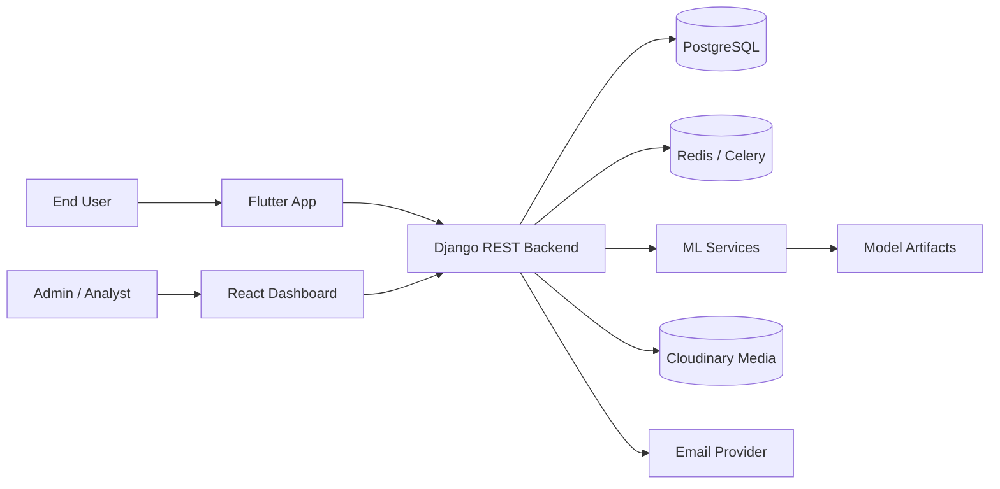
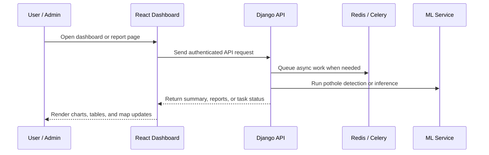
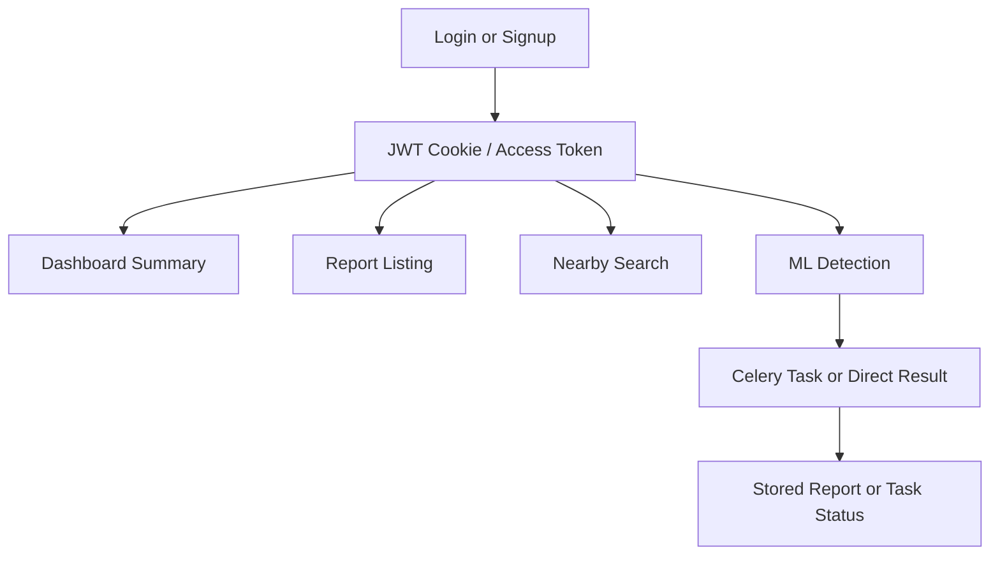

# Pitwatch-Ai-road-suvaliance-app-

Pitwatch-Ai-road-suvaliance-app- is an AI-assisted road surveillance platform for detecting potholes, tracking hazard reports, and presenting operational insights across a Flutter mobile app, a Django REST backend, and a React dashboard.

## At A Glance

| Area | What it does |
| --- | --- |
| Flutter app | Field and mobile experience for users, including driver drowsiness monitoring |
| Django backend | Auth, reports, dashboard summary, ML orchestration |
| React dashboard | Admin analytics, report management, live map |
| ML assets | Detection models and inference helpers |

## Contents

- [Pitwatch-Ai-road-suvaliance-app-](#pitwatch-ai-road-suvaliance-app-)
  - [At A Glance](#at-a-glance)
  - [Contents](#contents)
  - [Project Overview](#project-overview)
  - [Key Capabilities](#key-capabilities)
  - [Architecture](#architecture)
  - [Request Flow](#request-flow)
  - [Repository Layout](#repository-layout)
  - [Backend Modules](#backend-modules)
    - [Backend API Flow](#backend-api-flow)
  - [Frontend Modules](#frontend-modules)
  - [Flutter App](#flutter-app)
  - [Drowsiness Monitoring (Flutter)](#drowsiness-monitoring-flutter)
    - [Emergency Escalation in Drowsiness Flow](#emergency-escalation-in-drowsiness-flow)
  - [ML Artifacts](#ml-artifacts)
  - [Tech Stack](#tech-stack)
  - [Environment Setup](#environment-setup)
    - [Backend environment variables](#backend-environment-variables)
    - [Backend run commands](#backend-run-commands)
    - [Frontend run commands](#frontend-run-commands)
    - [Flutter run commands](#flutter-run-commands)
  - [Docker](#docker)
  - [Main API Routes](#main-api-routes)
    - [Accounts](#accounts)
    - [Reports](#reports)
    - [ML](#ml)
    - [Dashboard](#dashboard)
  - [Notes](#notes)
  - [Demo Access](#demo-access)
  - [Contributing](#contributing)

## Project Overview

The system is organized as a monorepo with three major parts:

- `APP/pitwatch`: Flutter client for mobile or cross-platform use.
- `BACKEND/pitwatch`: Django REST API, authentication, reporting, dashboard summary, and ML orchestration.
- `FRONTEND`: React and Vite admin dashboard for analytics, reports, and live map exploration.
- `ML`: Model training, inference helpers, and exported AI artifacts.

## Key Capabilities

- User and admin authentication with JWT-based flows.
- Pothole report creation, listing, pagination, and status updates.
- Dashboard summary metrics and seven-day trend data.
- ML-assisted pothole detection and async detection job tracking.
- Nearby pothole lookup on a live map using geocoding and map markers.
- Real-time driver drowsiness monitoring with on-device face and eye-state checks.
- Email-driven report workflows for emergency and pothole notifications.

## Architecture

The diagram below shows the main runtime relationships at a glance.



## Request Flow

This is the most common path through the product:

1. A user or admin opens the React dashboard.
2. The dashboard sends an authenticated API request to Django.
3. Django returns reports, summaries, or queues work through Redis and Celery.
4. ML services run pothole detection or inference when needed.
5. The dashboard renders the response as charts, tables, and map markers.



## Repository Layout

The four top-level folders are the fastest way to orient yourself in the repo.

```text
Pitwatch workspace
|-- APP/pitwatch       Flutter app
|-- BACKEND/pitwatch   Django API and workers
|-- FRONTEND           React admin dashboard
|-- ML                 ML notebooks, scripts, and exported models
```

## Backend Modules

The Django backend exposes API routes under `api/<version>/...`:

- `accounts`: signup, login, refresh, logout, profile, and admin auth.
- `reports`: report creation, listing, nearby search, emergency flows, and status updates.
- `ml`: pothole detection endpoints, status polling, and user report history.
- `dashboard`: summary metrics for the analytics dashboard.

### Backend API Flow



## Frontend Modules

These pages are the primary UI surfaces in the dashboard.

The React dashboard currently provides these routes:

- `/` for login.
- `/dashboard` for analytics cards and trend charts.
- `/reports` for searchable and filterable hazard reports.
- `/livemap` for location search and nearby pothole visualization.

## Flutter App

The Flutter application lives in `APP/pitwatch` and contains the mobile-facing screens, providers, services, and widgets used for the road-safety workflow.

## Drowsiness Monitoring (Flutter)

The mobile app includes a drowsiness safety flow designed for drivers:

- Uses the front camera with ML Kit face detection to monitor eye-open probability in near real time.
- Triggers a drowsiness alert when both eyes remain below threshold for a short sustained window.
- Plays a looping alarm sound and starts an on-screen SOS countdown.
- Automatically triggers emergency escalation if the user does not respond in time.

### Emergency Escalation in Drowsiness Flow

When drowsiness is confirmed and the countdown is not cancelled:

1. The app places an SOS phone call from the alert screen.
2. The app posts emergency context (location and report details) to `POST /api/v1/reports/emergency/`.
3. The backend handles emergency email/report processing for responder notification.
4. The alert screen closes after escalation is triggered.

Implementation entry points:

- `APP/pitwatch/lib/screens/drowsiness/eye_monitoring_screen.dart`
- `APP/pitwatch/lib/screens/drowsiness/drowsiness_alert_screen.dart`

## ML Artifacts

The `ML` folder contains model-related assets and scripts, including exported weights such as ONNX and TFLite files. These are used for pothole detection and related inference workflows.

## Tech Stack

- Backend: Django, Django REST Framework, SimpleJWT, Celery, Redis, PostgreSQL.
- Frontend: React, Vite, Redux Toolkit, React Router, Axios, Recharts, Leaflet.
- Mobile: Flutter.
- AI / ML: ONNX, TFLite, OpenCV, NumPy.

## Environment Setup

Start with the backend, then the frontend, then Flutter if you need the mobile client.

### Backend environment variables

Use `BACKEND/.env.example` as the baseline. Important values include:

- `DJANGO_SECRET_KEY`
- `DJANGO_DEBUG`
- `DJANGO_ALLOWED_HOSTS`
- `CORS_ALLOWED_ORIGINS`
- `DB_NAME`
- `DB_USER`
- `DB_PASSWORD`
- `DB_HOST`
- `DB_PORT`
- `DB_SSLMODE`
- `REDIS_URL`
- `CACHE_URL`
- `BREVO_API_KEY`
- `BREVO_API_URL`
- `BREVO_SENDER_EMAIL`
- `BREVO_SENDER_NAME`
- `CLOUDINARY_CLOUD_NAME`
- `CLOUDINARY_API_KEY`
- `CLOUDINARY_API_SECRET`

### Backend run commands

```bash
cd BACKEND/pitwatch
python -m venv .venv
.venv\Scripts\activate
pip install -r requirements.txt
python manage.py migrate
python manage.py runserver
```

### Frontend run commands

```bash
cd FRONTEND
npm install
npm run dev
```

### Flutter run commands

```bash
cd APP/pitwatch
flutter pub get
flutter run
```

## Docker

The backend includes a `Dockerfile` and `docker-compose.yml` for running the web service and Celery worker together.

```bash
cd BACKEND
docker compose up --build
```

## Main API Routes

### Accounts

- `POST /api/v1/accounts/signup/`
- `POST /api/v1/accounts/login/`
- `POST /api/v1/accounts/token/refresh/`
- `POST /api/v1/accounts/logout/`
- `GET /api/v1/accounts/me/`
- `POST /api/v1/accounts/admin/login/`
- `POST /api/v1/accounts/admin/token/refresh/`
- `POST /api/v1/accounts/admin/logout/`
- `GET /api/v1/accounts/admin/me/`

### Reports

- `GET /api/v1/reports/`
- `POST /api/v1/reports/`
- `GET /api/v1/reports/counts/`
- `GET /api/v1/reports/admin/all/`
- `GET /api/v1/reports/nearby/`
- `PATCH /api/v1/reports/<report_id>/status/`
- `POST /api/v1/reports/emergency/`

### ML

- `GET /api/v1/ml/detect/`
- `POST /api/v1/ml/detect/submit/`
- `GET /api/v1/ml/detect/status/<task_id>/`
- `GET /api/v1/ml/detect/my-reports/`

### Dashboard

- `GET /api/v1/dashboard/summary/`

## Notes

- The backend uses PostgreSQL, Redis, Cloudinary, and email delivery integrations, so the related services must be configured before production use.
- The frontend expects a valid backend API base URL and a stored access token for protected routes.
- The live map uses OpenStreetMap geocoding and Leaflet rendering for nearby pothole exploration.

## Demo Access

Use the hosted admin dashboard for quick product walkthroughs:

- URL: https://pit-watch.vercel.app/
- Username: admin
- Password: pass@123

## Contributing

Keep changes focused, document any new routes or environment variables, and update the architecture diagram if the system layout changes.